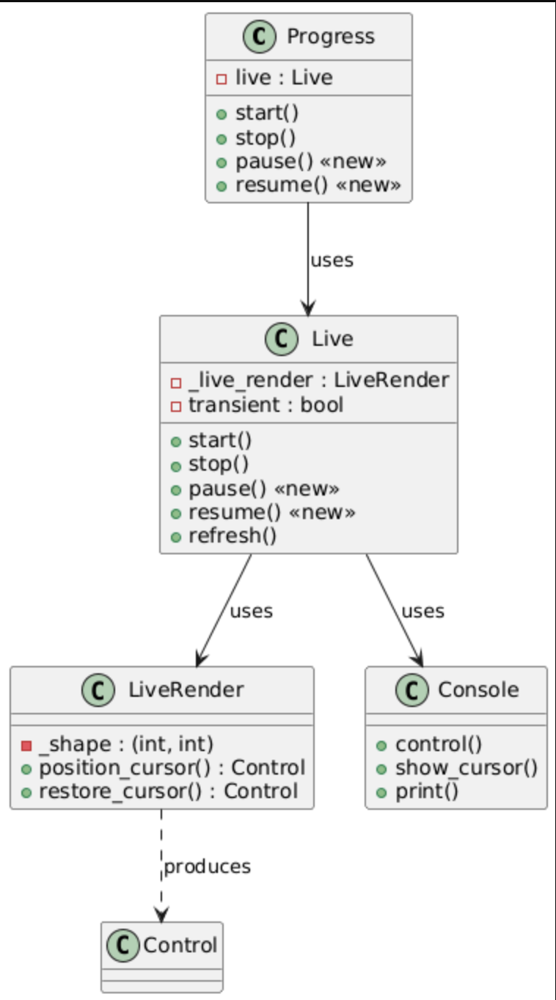

# Report for assignment 4

This is a template for your report. You are free to modify it as needed.
It is not required to use markdown for your report either, but the report
has to be delivered in a standard, cross-platform format.

## Project

Name: Rich

URL: https://github.com/DD2480-2026-Group-8/rich-Assignment-4

Rich is a Python library for rich text and beautiful formatting in the terminal (tables, progress bars, markdown, syntax highlighting, and more). We use only the Python code in the `rich/` package.

## Onboarding experience

Did you choose a new project or continue on the previous one?
We continued with the same project (Rich) from Assignment 3, so we already had familiarity with the codebase and tooling.

### Setup steps

Since we already had experience from Assignment 3, setup was straightforward:

1. **Clone the repository**

   ```
   git clone git@github.com:DD2480-2026-Group-8/rich-Assignment-4.git
   cd rich-Assignment-4
   ```

2. **Install Poetry**
   Rich uses [Poetry](https://python-poetry.org/) for packaging and dependency management, as documented in `CONTRIBUTING.md`. We installed it with `pip3 install poetry`. Poetry version 2.3.2 was installed; Python 3.12.1 was already available.

3. **Create virtual environment and install dependencies**

   ```
   python3 -m venv .venv
   source .venv/bin/activate
   poetry install
   ```

   Poetry installed 25 packages (pytest, black, mypy, pygments, markdown-it-py, etc.) and the Rich project itself in editable mode. No errors or manual intervention required.

4. **Run the test suite**

   ```
   TERM=unknown pytest tests/ -v --tb=short
   ```

   Result: **952 passed, 25 skipped** in 5.5 seconds. All 25 skips are platform-specific (Windows-only tests) or optional-dependency tests. No failures.

5. **Run tests with coverage**
   ```
   pytest tests/ --cov=rich --cov-report=term-missing -q
   ```
   Result: **95% overall coverage**. The file relevant to our issue (`rich/progress.py`) has 92% coverage.

### Quality of onboarding documentation

The project's `CONTRIBUTING.md` provides clear instructions: install Poetry, create a fork, run `poetry install`, then use `make test` / `make typecheck` / `make format-check`. The `Makefile` wraps common commands. The README is aimed at end users (install with `pip`, usage examples) and does not describe developer setup, but `CONTRIBUTING.md` fills that gap well.

Compared to Assignment 3, setup was faster because we already knew the project structure and tooling. The only new step was installing Poetry (which was not on the system), which took under a minute.

### Existing CI

The project already has a GitHub Actions workflow (`.github/workflows/pythonpackage.yml`) that runs on pull requests. But added also so it is triggered on push to the master branch. And also had to manually turn it on for the repository.

## Effort spent

For each team member, time spent (in hours) per activity:

| Activity                        | Filip | Anna | Jingze | Louisa | Erik |
| ------------------------------- | ----- | ---- | ------ | ------ | ---- |
| 1. Plenary discussions/meetings | 2     | 2    | 2      |        | 2    |
| 2. Discussions within subgroup  | 4     | 2    | 1      |        | 1    |
| 3. Reading documentation        | 2.5   | 1.5  | 1.5    |        | 2    |
| 4. Configuration and setup      | 0.5   | 0.5  | 0.5    |        | 3    |
| 5. Analyzing code/output        | 4     | 3.5  | 6      |        | 2    |
| 6. Writing documentation        | 6     | 1.5  | 1      |        | 2    |
| 7. Writing code                 | 1     | 7    | 6      |        | 1    |
| 8. Running code                 | 2     | 2    | 2      |        | 1    |
| **Per-person total**            | 22    | 20   | 20     |        | 14   |

### Contributions

| Name   | GitHub username      |
| ------ | -------------------- |
| Filip  | @FilipDimitrijevic97 |
| Anna   | @annaLiksomething    |
| Jingze | @JingzeGuo           |
| Louisa | @louisazhangg        |
| Erik   | @eSirborg            |

For setting up tools and libraries (step 4), enumerate all dependencies
you took care of and where you spent your time, if that time exceeds
30 minutes:

No dependency took more than 30 minutes. Poetry and all 25 project packages via `poetry install` were the only installs needed. That part of the set up took less than 30 minutes. However the overall approach, creating a coverage branch for testing, did require some thought process before starting with the issue. Detailed documentation can be seen in setup experience section.

## Overview of issue(s) and work done.

Title: [BUG] Progress with multiple tasks and transient will delete written lines on stop() and start()

URL: https://github.com/Textualize/rich/issues/3121

Summary in one or two sentences: When using `Progress` with `transient=True` and multiple tasks, calling `stop()` and then `start()` deletes previously printed lines from the terminal. The maintainer clarified that `stop()` was never designed for pause/restart; the solution is to add a new `pause()` and `resume()`, making the issue a feature request.

Scope (functionality and code affected). `rich/live.py` (Live), `rich/progress.py` (Progress). New methods `pause()` and `resume()` on Live and Progress. In `pause()`, we reset `LiveRender._shape` (no changes to `live_render.py` itself).

## Requirements for the new feature or requirements affected by functionality being refactored

Optional (point 3): trace tests to requirements.
| ID          | Title                          | Description               | Set Up                 | Action           | Expected Outcome           |
| ----------- | ------------------------------ | ------------------------- | ---------------------- | ---------------- | -------------------------- |
| REQ-1 | Transient progress clears on pause | When paused, progress bar lines are erased from the terminal. | Create a terminal console, start a Live instance with `transient=True`, render some content with `update()`, discard render output | Call `pause()` | Output contains `\x1b[1A` (cursor up) and `\x1b[2K` (erase line), and `live._live_render._shape` is `None` | 
| REQ-2 | Resume preserves prior output | Lines printed before `pause()` must not be overwritten after `resume()`. | Create a terminal console, start a Live instance with `transient=True`, print a line with `console.print()`, call `pause()`, discard output | Call `resume(refresh=False)` | Output is  `\x1b[?25l` — no cursor movement sequences, prior printed lines were not touched |
| REQ-3 | Restart renders correctly | After `resume()`, progress bars render at the correct position. | Create a terminal console, start a Live instance with `transient=True`, render content, call `pause()`, discard output, start new capture | Call `resume()` | Output contains `\x1b[?25l` (cursor hidden) and render hooks are restored |
| REQ-4 | Safe to call pause/resume twice | Calling `pause()` when already paused, or `resume()` when already showing, must do nothing and not crash. | Create a Live instance, start it | Call `pause()` twice, then `resume()` twice |  No exception is raised, `live._paused` is `False` and `live._started` is `True` after the double resume |
| REQ-5 | Non-transient unaffected | Behavior for `transient=False` unchanged. | Create a terminal console, start a Live instance with `transient=False`, render some content, discard render output, start new capture | Call `pause()` |  Output is  `\x1b[?25h` - show cursor only |

## Code changes

### Patch

Three files were modified:

- `rich/live.py`

- `rich/progress.py`

- `tests/test_live.py `

The primary changes include:

- Adding new `pause()` and `resume()` functions

- Making minor adjustments to the existing `stop()` method
- Adding tests

The patch was generated using:

```bash
git diff e90abf9 HEAD -- rich/live.py
git diff e90abf9 HEAD -- rich/progress.py
git diff e90abf9 HEAD -- tests/test_live.py
```

## The patch is clean. (optional, P4)
(a) We add new code rather than refactor; there is no obsolete code to remove or comment out. (b) The patch produces no extraneous output such as debug prints. (c) All code is formatted with Black (the project standard); we run `poetry run black .` before committing, so there are no unnecessary whitespace changes. Black formatting is required for CI to pass (the format-check step fails otherwise), so the patch is consistent with the project’s style and passes all automated checks when merged into master.

## Test results

A total of nine tests were added for the refactored code. Since refactoring consisted of adding new methods, the test were focused on assesing those, which meant no change present in coverage. As the tests and new code were written in parallel, a bug was detected when testing: calling `stop()` after `pause()` resulted in index error, as `stop()` was attempting to clear an already empty stack (`pause()`cleared it first). The bug was resolved and all tests pass now.

All outlined requirements have a test associated with it. REQ-1 is tested for alt screen and Jupyter as cursor restore must be skipped.  `test_paused_resumed_refresh_thread` while is not linked to one of the outlined requirements, checks the basic functionality of `pause()` and `resume()` making sure `refresh()` is not called during pause and is restored after resuming. The situation is similar with `test_stop_after_pause`

| Test                                         | REQ-1 | REQ-2 | REQ-3 | REQ-4 | REQ-5 |
| -------------------------------------------- | ----- | ----- | ----- | ----- | ----- |
| `test_live_state`                            |       |       |       | ✓     |       |
| `test_paused_resumed_refresh_thread`         |       |       |       |       |       |
| `test_pause_resume_twice`                    |       |       |       | ✓     |       |
| `test_stop_after_pause`                      |       |       |       |       |       |
| `test_pause_resume_transient_clears_display` | ✓     |       | ✓     |       |       |
| `test_pause_non_transient`                   |       |       |       |       | ✓     |
| `test_pause_transient_alt`                   | ✓     |       |       |       |       |
| `test_pause_transient_jupyter`               | ✓     |       |       |       |       |
| `test_resume_preserves_prior_output`         |       | ✓     |       |       |       |

```python
tests/test_live.py::test_live_state PASSED
tests/test_live.py::test_paused_resumed_refresh_thread PASSED
tests/test_live.py::test_pause_resume_twice PASSED
tests/test_live.py::test_stop_after_pause PASSED
tests/test_live.py::test_pause_resume_transient_clears_display PASSED
tests/test_live.py::test_pause_non_transient PASSED
tests/test_live.py::test_pause_transient_alt PASSED
tests/test_live.py::test_pause_transient_jupyter PASSED
tests/test_live.py::test_resume_preserves_prior_output PASSED
```

## UML class diagram and its description

### Key changes/classes affected

**Summary of changes:** The diagram shows the five main classes involved in the Live display subsystem. Our contribution adds two new methods to both **Progress** and **Live**: `pause()` and `resume()` (marked `<<new>>` in the diagram). No new classes were introduced.



#### Architecture diagram

The following diagram summarises the main components and data flow:

```
┌─────────────────────────────────────────────────────────────────────────────┐
│                         RICH ARCHITECTURE                                   │
├─────────────────────────────────────────────────────────────────────────────┤
│                                                                             │
│   User code                                                                 │
│        │                                                                    │
│        ▼                                                                    │
│   ┌──────────┐   renderables    ┌─────────────┐   segments                  │
│   │ Progress │ ───────────────► │   Console   │ ◄────────── (text+style)    │
│   │  Table   │  __rich_console__│   (print)   │                             │
│   │  Live    │                  └──────┬──────┘                             │
│   └──────────┘                         │                                    │
│        │                               │ ANSI codes                         │
│        │ Live path                     ▼                                    │
│        ▼                       ┌─────────────┐                              │
│   ┌──────────┐  render hook    │  stdout /   │                              │
│   │   Live   │ ◄───────────────│  terminal   │                              │
│   └────┬─────┘ process_render  └─────────────┘                              │
│        │                                                                    │
│        ▼                                                                    │
│   ┌──────────────┐  Control (cursor up, erase)                              │
│   │  LiveRender  │ ───────────────────────────► ANSI output                 │
│   │  (_shape)    │                                                          │
│   └──────────────┘                                                          │
│                                                                             │
└─────────────────────────────────────────────────────────────────────────────┘
```

### Architectural overview

#### Purpose

Rich is a Python library for rich text and beautiful formatting in the terminal. It lets developers add colour, style, tables, progress bars, markdown, syntax highlighting, and tracebacks to terminal output. The library targets Python 3.8+ and runs on Linux, macOS, and Windows. It is widely used in CLI tools, build systems, and development environments.

#### Core abstraction: renderables

The central abstraction in Rich is the **renderable**. Any object that can be displayed implements `__rich_console__()`, which receives a `Console` and `ConsoleOptions` and yields **segments**, pieces of text plus optional style (colour, bold, etc.). Strings, `Text`, `Table`, `Panel`, and `Progress` are all renderables. The `Console` class is the main entry point: it receives renderables, resolves them to segments, applies styles, and writes ANSI escape sequences to the output stream (stdout, a file, or a buffer).

#### Rendering pipeline

When `Console.print()` is called, the Console walks the renderable tree. Each renderable’s `__rich_console__()` is invoked; it may yield segments directly or delegate to child renderables. Segments are collected, measured, and laid out according to the terminal width. The Console then converts segments to ANSI codes and writes them. For interactive terminals, the Console can also redirect stdout/stderr so that `print()` goes through Rich.

#### Live display subsystem

Some content updates over time (e.g. progress bars, spinners). Rich uses the **Live** class for this. Live registers a **render hook** with the Console: before any output is written, the hook’s `process_renderables()` is called. It injects a “reset” step (move cursor to the top of the live area) and the current renderable. The result is that the live area is redrawn in place on each refresh.

**LiveRender** wraps the actual renderable and tracks `_shape`, the width and height of the last render. This is needed because the reset step must move the cursor up by the correct number of lines. `position_cursor()` returns a **Control** object: a sequence of ANSI codes (carriage return, cursor up, erase line) that moves the cursor to the top of the live area and erases the previous content. **Control** is a small class that holds these non-printable codes; the Console outputs them via `control()`.

When Live is stopped (e.g. when a progress bar finishes), the hook is removed. If `transient=True`, Live also calls `restore_cursor()`, a Control that moves the cursor up and erases the live area so it disappears. The bug we address: `_shape` was not reset after this, so a subsequent `start()` used stale height and overwrote prior output.

#### Progress layer

**Progress** is a high-level API for progress bars. It creates a Live instance with a renderable that displays one or more task rows (description, bar, percentage, time). Progress delegates `start()` and `stop()` to Live. Users call `add_task()`, `advance()`, and `refresh()`. Progress also supports `transient=True`, which clears the bars when done.

### Design patterns

Our `pause()` and `resume()` methods extend the Live display subsystem. `pause()` hides the progress bars (like transient stop): it removes the render hook, stops the refresh thread, clears the display (if transient), and resets `_shape`. `resume()` re-adds the render hook, restarts the refresh thread, and triggers a refresh so the bars reappear at the current cursor position. This supports the use case of temporarily hiding progress for user input (e.g. a prompt) and then resuming.

## Overall experience

### Main takeaways

Our main take-away was experience from working on a real open-source codebase such as Rich. Unlike the earlier assignments where we controlled the entire project, this project required understanding much code and architecture that had already been established and making our changes compatible with what already existed.
We also learned how it's important to clarify the entire design to avoid having design decisions be misinterpreted as bugs, which was clarified by the maintainer of the project.

### Evaluation based on the Essence standard

### Team Alpha
We have improved since the first assignments, when most of our growth. At the beginning of the course, the team was in the formed state.  By Assignment 2, we judged that we had gone into the collaborative state. Responsibilities were clear, and members worked independently. 
During Assignment 3, the compressed timeline created weaknesses when it came to planning and task distribution. Individual contributions were completed, coordination around work products was not fully under control. 
In Assignment 4, we addressed these shortcomings by clarifying deadlines and defining goals more clearly. Roles remained clearly divided. By this stage, the Team alpha had reached the stable and performing state.
The use of SEMAT checklists contributed to this progression. Even though they were a bit abstract, they were useful as points that helped us assess progress. 7

### Opportunity Alpha:
In Assignment 4, we explicitly progressed through the Opportunity alpha states. We began by identifying an issue in the upstream project, articulating the value of resolving it, and evaluating its feasibility within the scope and constraints of the course. After confirming viability, we proceeded with implementation and validation.
This structured progression reflects a deliberate movement from opportunity identification to value realization, rather than treating the issue purely as a technical task.

### Context within Best Software Engineering Practice:
Iterative improvement: Each assignment functioned as an iteration in which we reflected on process weaknesses and implemented adjustments. One clear mistake occurred during Assignment 3 when we underestimated coordination complexity under time pressure, but we could improve on this later.
Role allocation: Everyone was given a role with defined objectives for the project. 
Process evaluation: Using SEMAT’s alphas and checklists made self assessment more systematic.

Optional (point 7): After picking an issue we got in contact with maintainer, who advised to approach the issue differently from what we hsve planned initially. We believe it exceeds the scope of the assignment.
